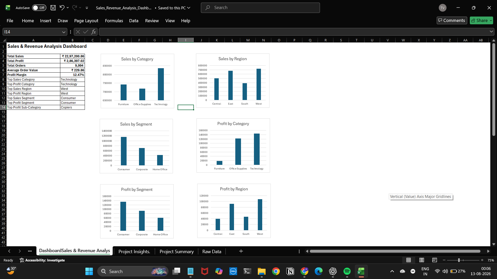
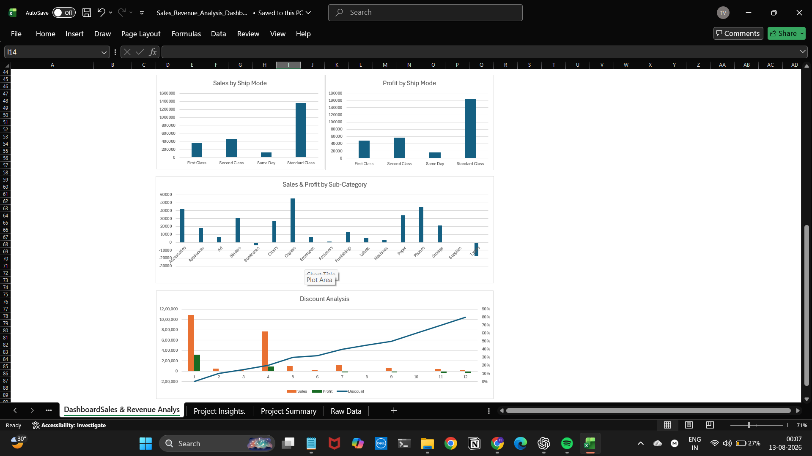
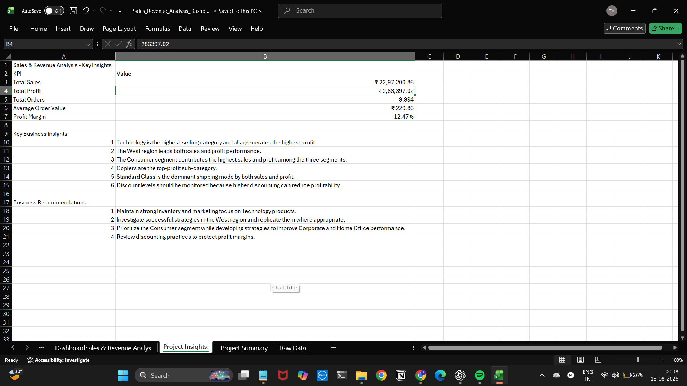

# Sales & Revenue Analysis Dashboard

## Project Overview

An interactive Sales & Revenue Analysis Dashboard built using Microsoft Excel and the Superstore Sales Dataset.

The project analyzes sales, profit, orders, customer segments, regions, product categories, shipping modes, and discount performance to identify important business trends and actionable insights.

## Tools Used

- Microsoft Excel
- Excel Formulas
- Data Analysis
- Data Visualization
- Dashboard Design

## Key Performance Indicators

| KPI | Value |
|---|---:|
| Total Sales | ₹22,97,200.86 |
| Total Profit | ₹2,86,397.02 |
| Total Orders | 9,994 |
| Average Order Value | ₹229.86 |
| Profit Margin | 12.47% |

## Key Business Insights

1. Technology is the highest-selling category and also generates the highest profit.
2. West is the strongest region for both sales and profit.
3. Consumer is the strongest segment in both sales and profit.
4. Copiers are the top-profit sub-category.
5. Standard Class is the dominant shipping mode by both sales and profit.
6. Higher discount levels can negatively affect profitability and should be monitored.

## Business Recommendations

- Focus inventory and marketing efforts on high-performing Technology products.
- Study successful strategies in the West region and replicate them where appropriate.
- Strengthen Consumer segment performance while improving Corporate and Home Office results.
- Control excessive discounting to maintain healthy profit margins.

## Dashboard Preview

### Dashboard Overview

### Sales & Profit Analysis

### Business Insights

## Project Files

- `Sales_Revenue_Analysis_Dashboard.xlsx` - Complete Excel dashboard and analysis
- `dashboard-overview.png` - Dashboard overview screenshot
- `dashboard-analysis.png` - Sales and profit analysis screenshot
- `business-insights.png` - Business insights screenshot

## Skills Demonstrated

- Data Analysis
- Excel Formulas
- KPI Analysis
- Data Visualization
- Dashboard Design
- Business Insights
- Business Recommendations
